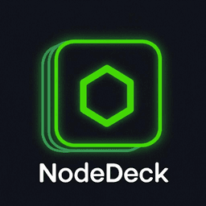
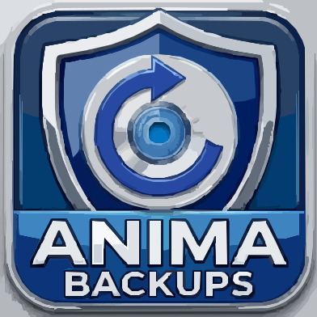
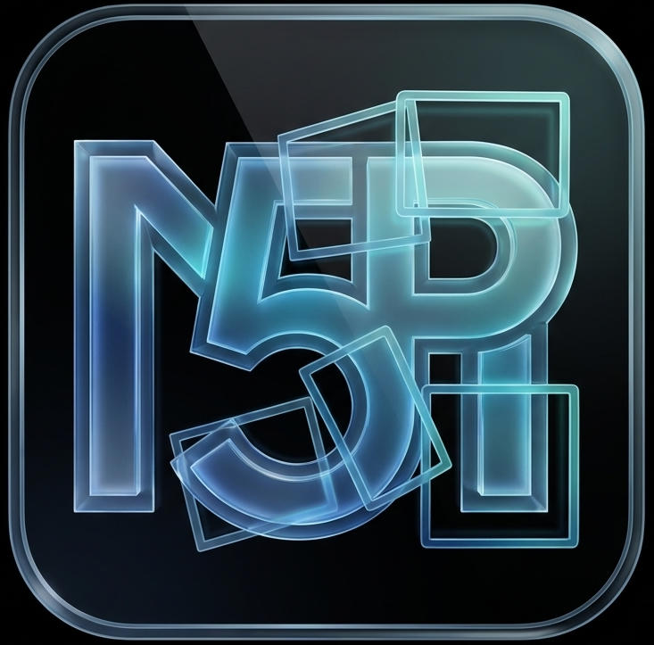

## Hey, I'm Mario

 
 
I'm a systems developer and sysadmin, building cross-platform tools and systems software under the **aNima** brand. Rust + Tauri specialist with contributions merged in `tauri-apps` and `microsoft`. Shipping honest software from Spain, with tests.
 Ask me about rust, tauri, systems or backend, 
    I am happy to help
 

  
### More About Me:

- 🤝 &nbsp; I'm looking to [collaborate](mailito:hola@marioramos.es)
- <picture><source media="(prefers-color-scheme: dark)" srcset="assets/icons/github.svg"><source media="(prefers-color-scheme: light)" srcset="assets/icons/github-black.svg"></picture>&nbsp; Most of my projects are available on [Github](https://github.com/marrionesa?tab=repositories)
- &nbsp; Most of my plugins are available on [crates.io](https://crates.io/users/marrionesa) 
- 📫 &nbsp; Feel free to ping me on [marioramos.me](https://marioramos.me)
- &nbsp; Checkout my [npm packages](https://www.npmjs.com/~marrionesa)

- 📚 &nbsp; El mejor código sale después de medianoche  

 

### Languages and Tools:

 
 

### GitHub Stats:

 

 

### Open Source Contributions:

<table>
  <thead>
    <tr>
      <th>📦 Repository</th>
      <th>🔀 PR / Contribution</th>
      <th>✅ Status</th>
      <th>⭐ Stars</th>
    </tr>
  </thead>
  <tbody>
    <tr>
      <td>&nbsp;<a href="https://github.com/tauri-apps/tauri"><b>tauri-apps/tauri</b></a></td>
      <td><a href="https://github.com/tauri-apps/tauri/pull/16057">#16057</a> — test soundness after Rust edition 2024</td>
      <td></td>
      <td></td>
    </tr>
    <tr>
      <td>&nbsp;<a href="https://github.com/tauri-apps/tao"><b>tauri-apps/tao</b></a></td>
      <td><a href="https://github.com/tauri-apps/tao/pull/1351">#1351</a> — fix(linux) raw_display_handle_rwh_06 UB</td>
      <td></td>
      <td></td>
    </tr>
    <tr>
      <td>&nbsp;<a href="https://github.com/microsoft/tgrep"><b>microsoft/tgrep</b></a></td>
      <td><a href="https://github.com/microsoft/tgrep/pull/178">#178</a> — Error::source() impl + 13 tests</td>
      <td></td>
      <td></td>
    </tr>
    <tr>
      <td>&nbsp;<a href="https://github.com/GoogleCloudPlatform"><b>GoogleCloudPlatform</b></a></td>
      <td>MCP — mcp-imagen-go deprecation routing + audit</td>
      <td></td>
      <td></td>
    </tr>
  </tbody>
</table>

 

### My Projects:

<table>
  <tr>
    <td align="center" width="200">
      <a href="https://github.com/marrionesa/animabooter">
          
        
      </a>
    </td>
    <td align="center" width="200">
      <a href="https://github.com/marrionesa/nodedesk">
          
        
      </a>
    </td>
    <td align="center" width="200">
      <a href="https://github.com/marrionesa/animacam-os">
          
        
      </a>
    </td>
    <td align="center" width="200">
      <a href="https://github.com/marrionesa/animabackup">
          
        
      </a>
    </td>
  </tr>
  <tr>
    <td align="center" width="200">
      <a href="https://github.com/marrionesa/mp5-website">
          
        
      </a>
    </td>
  </tr>
</table>

 

### Tauri Plugins:

<table>
  <thead>
    <tr>
      <th>🔌 Plugin</th>
      <th>📝 Description</th>
      <th>⚙️ Stack</th>
    </tr>
  </thead>
  <tbody>
    <tr>
      <td></td>
      <td>Battery, power source and system sleep/wake events for Tauri v2 — Windows, macOS and Linux</td>
      <td><code>Rust</code></td>
    </tr>
    <tr>
      <td></td>
      <td>Control display brightness from a Tauri app: DDC/CI, ddcutil and Linux kernel backlight</td>
      <td><code>Rust</code></td>
    </tr>
    <tr>
      <td></td>
      <td>Google AdMob (Mobile Ads) for Tauri v2 apps on Android and iOS</td>
      <td><code>TypeScript</code></td>
    </tr>
    <tr>
      <td></td>
      <td>Six standalone Tauri v2 plugins — beep, hash, hostname, mimetype, timezone and uuid</td>
      <td><code>Rust</code></td>
    </tr>
    <tr>
      <td></td>
      <td>Platform-agnostic core primitives for animaCAM-OS camera and video applications</td>
      <td><code>Rust</code></td>
    </tr>
  </tbody>
</table>

 

### Contact:

<a href='https://github.com/marrionesa'><picture><source media='(prefers-color-scheme: dark)' srcset='assets/icons/github.svg'><source media='(prefers-color-scheme: light)' srcset='assets/icons/github.svg'></picture></a>&nbsp; &nbsp;<a href='https://www.linkedin.com/in/marrionesa/'><picture><source media='(prefers-color-scheme: dark)' srcset='assets/icons/mario-web.webp'><source media='(prefers-color-scheme: light)' srcset='assets/icons/firefox.svg'></picture> <picture><source media='(prefers-color-scheme: dark)' srcset='assets/icons/linkedin.svg'><source media='(prefers-color-scheme: light)' srcset='assets/icons/linkedin.svg'></picture></a>&nbsp; &nbsp;
